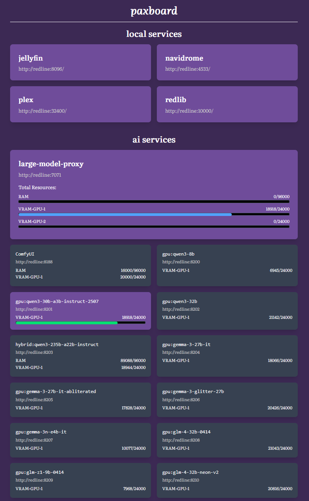

# `paxboard`



`paxboard` is my personal `homepage` alternative that serves the needs of one person: me. I will literally rewrite my own dashboard in TypeScript+React than spend any time configuring an existing service with YAML. I hate YAML almost as much as I hate the Python programming language.

There is no reason for you to use this.

## Tech Stack

- TypeScript
- React
- Vite
- Tailwind CSS 4

## Configuration

Copy `.env.example` to `.env` and customize:

```bash
cp .env.example .env
```

Set `VITE_BASE_URL` to your server's base URL (default: `http://redline`).

## Development

```bash
npm install
npm run dev
```

## Build

```bash
npm run build
```

## Preview

```bash
npm run preview
```
